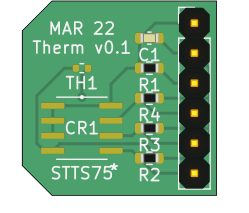

# Temperature Sensor Breakout Board

This is a breakout board for the [ST STTS75M2F](https://octopart.com/stts75m2f-stmicroelectronics-7124544) and [TDK NTCG103JF103FT1](https://octopart.com/ntcg103jf103ft1-tdk-19035495) design with KiCAD 6. PCB image generated using [PcbDraw](https://github.com/yaqwsx/PcbDraw).
