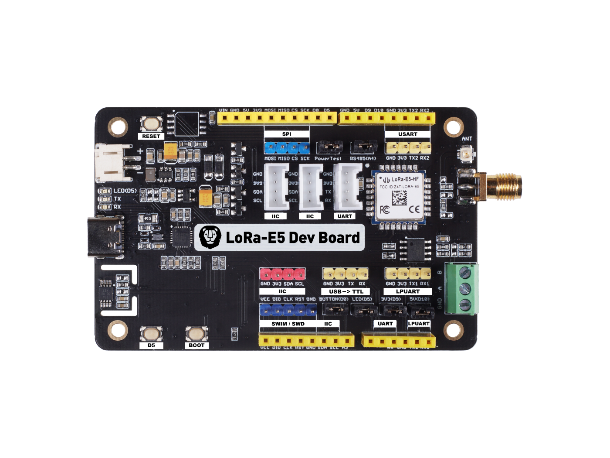

# ee193

## Useful links

- https://www.seeedstudio.com/LoRa-E5-Dev-Kit-p-4868.html
- https://www.st.com/en/microcontrollers-microprocessors/stm32wle5jc.html#
- https://www.digikey.com/en/products/detail/seeed-technology-co-ltd/113990934/13926230

- https://docs.platformio.org/en/latest/boards/ststm32/nucleo_wl55jc.html
- https://github.com/platformio/platform-ststm32/blob/develop/boards/nucleo_wl55jc.json
- https://docs.zephyrproject.org/2.7.0/boards/arm/lora_e5_dev_board/doc/lora_e5_dev_board.html

- https://www.st.com/en/development-tools/stm32cubeprog.html